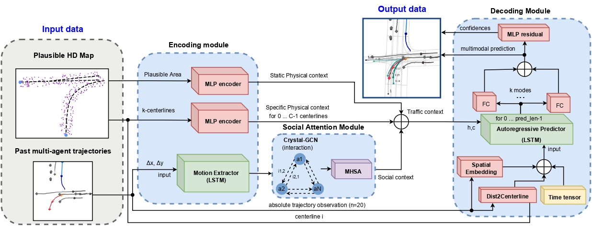
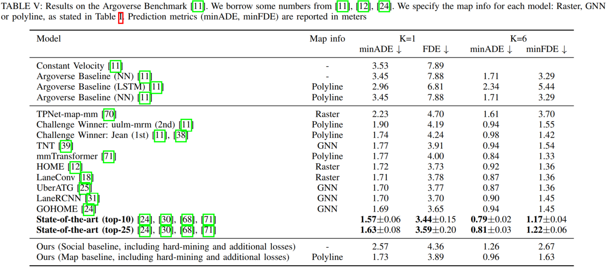
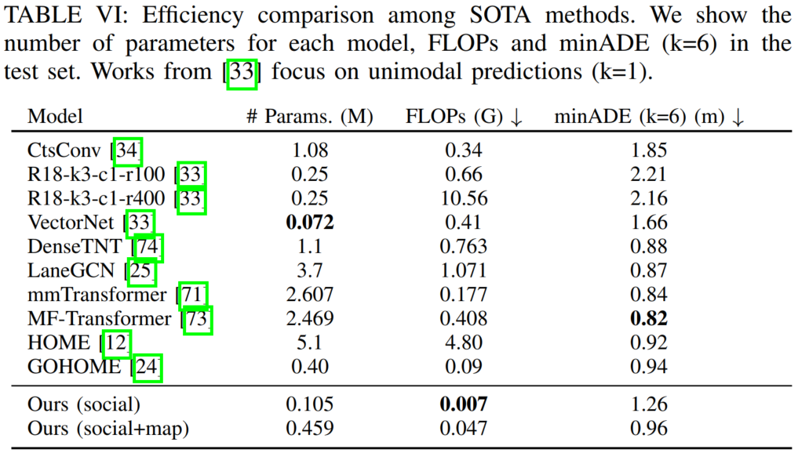
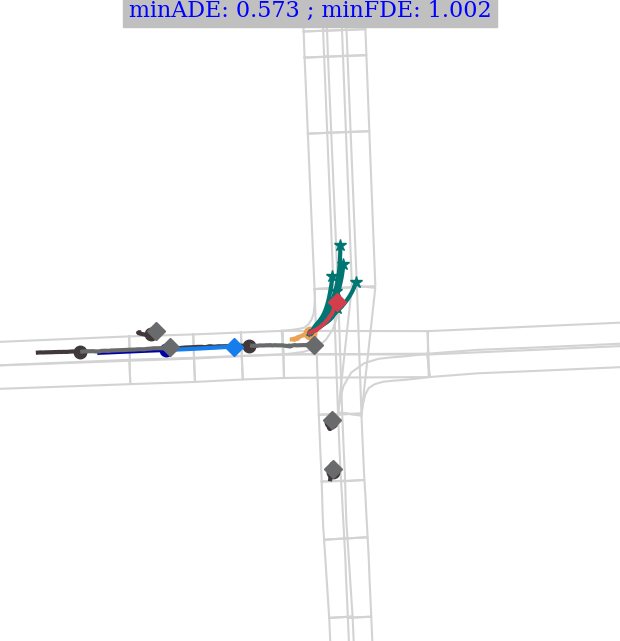
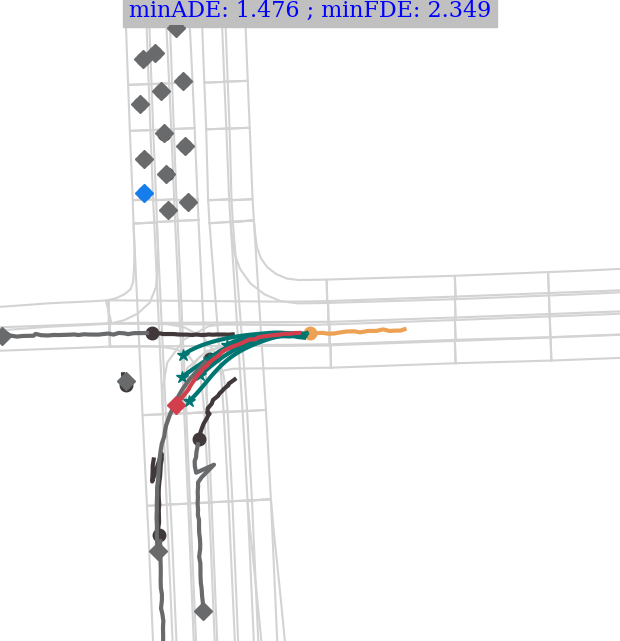

# Efficient Baselines for Motion Prediction in Autonomous Driving

[](https://arxiv.org/abs/2205.13071)


[Carlos Gómez-Huélamo](https://scholar.google.com/citations?view_op=list_works&hl=es&hl=es&user=OWwoG6EAAAAJ), 
[Marcos V. Conde](https://scholar.google.com/citations?user=NtB1kjYAAAAJ&hl=en)

[RobeSafe group, University of Alcalá, UAH](http://robesafe.es/index.php/en/research-staff/staff)

[Computer Vision Lab, CAIDAS, University of Würzburg](https://www.informatik.uni-wuerzburg.de/computervision/home/)

------------------

**News 🚀🚀**

- [01/2023] Work on Transactions on Intelligent Transportation Systems (T-ITS, Q1-JCR)
- [10/2022] GNN attention-based method will be released. We will extend the baselines :)
- [09/2022] Ongoing repo update. The most recent work was presented at IEEE ITSC 2022

------------------

This is the official repository and PyTorch implementations of different works presented at:
- [Fresh  Perspectives  on  the  Future  of  Autonomous  Driving](https://www.icra2022av.org/) Workshop at ICRA 2022
- [Multi-Agent Behavior:Representation, Modeling, Measurement, and Applications](https://sites.google.com/view/mabe22/home) Workshop at CVPR 2022
- [25th IEEE International Conference on Intelligent Transportation Systems](https://www.ieee-itsc2022.org/#/)

Our papers:
- [Exploring Map-based Features for Efficient Attention-based Vehicle Motion Prediction](https://arxiv.org/abs/2205.13071) at CVPRW ICRA 2022 Workshops
- [Exploring Attention GAN for Vehicle Motion Prediction](https://arxiv.org/abs/2209.12674) at IEEE International Conference on Intelligent Transportation Systems 2022



>Motion Prediction (MP) of multiple surroundings agents is a crucial task in arbitrarily complex environments, from simple social robots to self-driving vehicles. Current techniques tackle this problem using end-to-end pipelines, where the input data is usually a rendered top-view of the physical information and the past trajectories of the most relevant agents; leveraging this information is a must to obtain optimal performance. In that sense, a reliable Autonomous Driving (AD) system must produce reasonable predictions on time, however, despite many approaches use simple ConvNets and LSTMs, models might be too complex for real-time applications when using both sources of information (map and past trajectories). Moreover, the performance of such models highly depends on the amount of training data, which can be expensive (particularly the annotated High-Definition (HD) maps).

>In this work, we propose several baselines for the well-known Argoverse Motion Forecasting Benchmark. We aim to develop compact models using state-of-the-art techniques for MP, including attention mechanisms and GNNs.
Our lightweight models use standard social information and interpretable map information such as points from the driveable area and plausible centerlines, in opposition to black-box CNN-based methods for map processing, to generate plausible multimodal trajectories, achieving state-of-the-art accuracy.

<details>
<summary>Transformer-based Architecture Diagram (click me)</summary>
<p align="center">
  
</p>
</details>

<details>
<summary>GAN-based Architecture Diagram (click me)</summary>
<p align="center">
  
</p>
</details>

<br>

## Get Started and Usage

First of all, we highly encourage the use of the VSCode editor, regarding the debugging capability and its quite interesting extensions.

### Installation via Docker

Coming soon ...

### Installation via Conda

Tested in Ubuntu 16.04, Ubuntu 18.04.

CUDA version >= 11.2

If available, check `requirements.txt`

```
conda create --name mapfe4mp_env python=3.8 \
conda install -n mapfe4mp ipykernel --update-deps --force-reinstall
```
```
python3 -m pip install --upgrade pip \
python3 -m pip install --upgrade Pillow \
```
```
pip install \
    prodict \
    torch \
    pyyaml \
    torchvision \
    tensorboard \
    glob2 \
    matplotlib \
    sklearn \
    gitpython \
    thop \
    fvcore \
    torchstat \
    torchsummary \
    ipykernel \
    sns
```
In order to install torch-geometric and associated modules for the GNN computations, please check the following documentation:

https://pytorch-geometric.readthedocs.io/en/latest/notes/installation.html

E.g.

```
pip install torch-scatter torch-sparse torch-cluster torch-spline-conv torch-geometric -f https://data.pyg.org/whl/torch-1.13.0+cu116.html
```

N.B.  If you find any error with the packages, try to install again the specific package separately.

Download argoverse-api (1.0) in another folder (out of this directory):

```
git clone https://github.com/argoai/argoverse-api.git
```

Go to the argoverse-api folder and install the requirements of setup.py.

N.B. Comment those packages that have specific versions, and just write the name of the package in order to have the latest version. E.g. numpy==1.19.9 -> numpy.
N.B. You must have the conda environment activated in order to have argoverse as a Python package of your environment

```
pip install -e .
```

Don't worry if there are some errors (such as "ERROR: Could not build wheels for opencv-python which use PEP 517 and cannot be installed directly"), just run ```pip install -e .``` again.

Finally, copy the map information of the Argoverse Motion-Forecasting 

### Argoverse Motion-Forecasting dataset v1.1

Check ```data/README.md```.

### How to train

Assuming your model is in model/models/```your_model.py/```, you must have the name of this script in the train.py script. Additionally, it is advisable to have a config file and trainer per model, since they must be quite different. For example:

```
python train.py --trainer mapfe4mp --device_gpu 3
```

### Notes

Recommended VSCode extensions:

- Jupyter 
- Python
- Python for VSCode

If you cannot open a Jupyter Notebook correctly, just reinstall the Jupyter extension in your VSCode editor.

Please, be aware that after installing a new extension, you should reload your VSCode window.

## Quantitative results



<br>



<br>

Please check [our papers](https://arxiv.org/abs/2205.13071) for further details.

To check your quantitative results using the Tensorboard tool, execute (assuming you have cloned this repo in your $HOME folder):

cd ~/mapfe4mp/save/argoverse/```your_model```/```your_split_percent``` && tensorboard --logdir . --port=```your_port```

E.g. cd ~/mapfe4mp/save/argoverse/mapfe4mp/100.0_percent && python -m tensorboard.main --logdir . --port=6100

## Qualitative results

If you would like to access all the qualitative samples for the Argoverse 1.0 validation set, please contact us.

We are preparing a **tutorial notebook** for generating these visualizations:

<p float="center">
  
  
  
  
</p>

## Citation and Acknowledgement

Please cite this work if you use our code or ideas.

Work done with Miguel Ortiz, Santiago Montiel, 
[Rafael Barea](https://scholar.google.es/citations?user=IktmiSAAAAAJ&hl=es), 
[Luis M. Bergasa](https://scholar.google.com/citations?hl=en&user=uEBILewAAAAJ) - [RobeSafe group](http://robesafe.es/index.php/en/research-staff/staff)

```
@article{gomez2022exploring,
  title={Exploring Map-based Features for Efficient Attention-based Vehicle Motion Prediction},
  author={G{\'o}mez-Hu{\'e}lamo, Carlos and Conde, Marcos V and Ortiz, Miguel},
  journal={arXiv preprint arXiv:2205.13071},
  year={2022}
}

@article{gomez2022gan,
  title={Exploring Attention GAN for Vehicle Motion Prediction},
  author={G{\'o}mez-Hu{\'e}lamo, Carlos and Conde, Marcos V. and Ortiz, Miguel and Montiel, Santiago and Barea, Rafael and Bergasa, Luis M.},
  journal={arXiv preprint arXiv:2209.12674},
  year={2022}
}
```

## Contact

Please add in the email subject "mapfe4mp" or "exploring map features paper"

Carlos Gómez-Huélamo: [carlos.gomezh@uah.es](mailto:carlos.gomezh@uah.es) \
Marcos Conde: [marcos.conde-osorio@uni-wuerzburg.de](mailto:marcos.conde-osorio@uni-wuerzburg.de)
