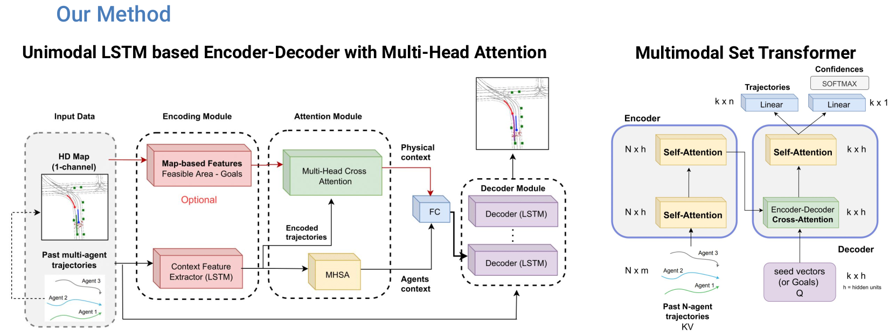
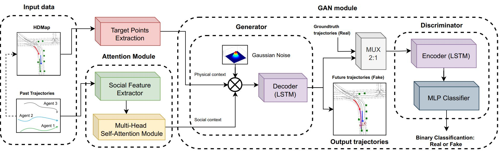
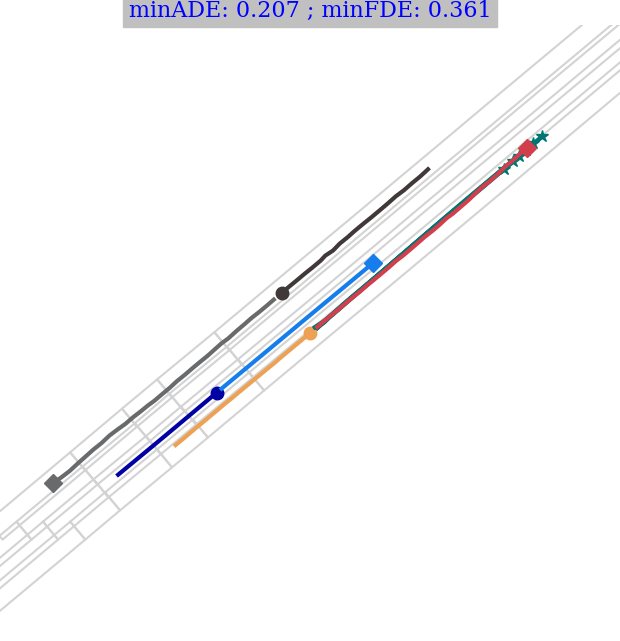
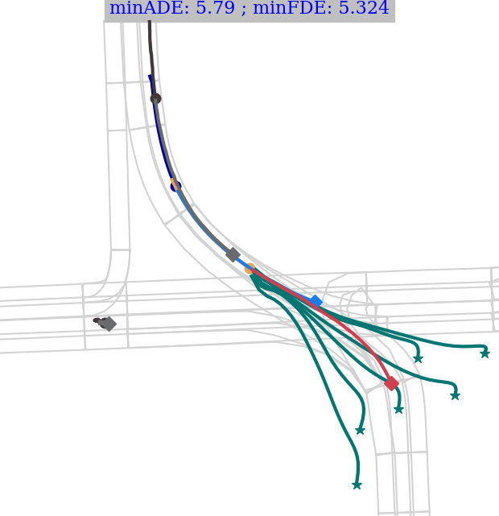
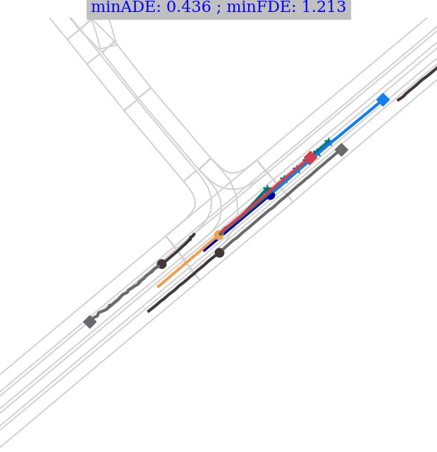

# <span style="font-size:0.8em;">**[CVPRW 2022] Exploring Map-based Features for Efficient Attention-based Vehicle Motion Prediction**</span>

[Carlos Gómez-Huélamo](https://scholar.google.com/citations?view_op=list_works&hl=es&hl=es&user=OWwoG6EAAAAJ), [Marcos V. Conde](https://scholar.google.com/citations?user=NtB1kjYAAAAJ&hl=en), Miguel Ortiz. 

Repo of the work presented at:
- [Fresh  Perspectives  on  the  Future  of  Autonomous  Driving](https://www.icra2022av.org/) Workshop at ICRA 2022
- [Multi-Agent Behavior:Representation, Modeling, Measurement, and Applications](https://sites.google.com/view/mabe22/home) Workshop at CVPR 2022
- [25th IEEE International Conference on Intelligent Transportation Systems](https://www.ieee-itsc2022.org/#/)

Check [our paper here!](https://arxiv.org/abs/2205.13071)

>Motion prediction (MP) of multiple agents is a crucial task in arbitrarily complex environments, from social robots to self-driving cars. Current approaches tackle this problem using end-to-end networks, where the input data is usually a rendered top-view of the scene and the past trajectories of all the agents; leveraging this information is a must to obtain optimal performance. In that sense, a reliable Autonomous Driving (AD) system must produce reasonable predictions on time, however, despite many of these approaches use simple ConvNets and LSTMs, models might not be efficient enough for real-time applications when using both sources of information (map and trajectory history). Moreover, the performance of these models highly depends on the amount of training data, which can be expensive (particularly the annotated HD maps). In this work, we explore how to achieve competitive performance on the Argoverse 1.0 Benchmark using efficient attention-based models, which take as input the past trajectories and map-based features from minimal map information to ensure efficient and reliable MP. These features represent interpretable information as the driveable area and plausible goal points, in opposition to black-box CNN-based methods for map processing.

<br>




Please cite this work if you use our code or ideas.

```
@article{gomez2022mapfemp,
  author = {Gómez-Huélamo, Carlos and Conde, Marcos V. and Ortiz, Miguel},
  title  = {Exploring Map-based Features for Efficient Attention-based Vehicle Motion Prediction},
  journal= {ICRA 2022 Workshops},
  year = {2022}
}
```

## Get Started and Usage

Tested in Ubuntu 16.04.

If available, check `requirements.txt`

```
conda create --name mapfe4mp_env python=3.8 \
conda install -n mapfe4mp ipykernel --update-deps --force-reinstall
```
```
python3 -m pip install --upgrade pip \
python3 -m pip install --upgrade Pillow \
```
```
pip install \
    prodict \
    torch \
    pyyaml \
    torchvision \
    tensorboard \
    glob2 \
    matplotlib \
    sklearn \
    gitpython \
    torchstat \
    torch_sparse \
    torch_geometric
```
Download argoverse-api (1.0) in another folder (out of this directory). \
Go to the argoverse-api folder: 
```
pip install -e . (N.B. You must have the conda environment activated in order to have argoverse as a Python package of your environment)
```

## Quantitative results

More details soon ...

## Qualitative results

More details soon ...





## Contact

Please add in the email subject "mapfe4mp" or "exploring map features paper"

Carlos Gómez-Huélamo. [carlos.gomezh@edu.uah.es](mailto:carlos.gomezh@edu.uah.es)
Marcos Conde [marcos.conde-osorio@uni-wuerzburg.de](mailto:marcos.conde-osorio@uni-wuerzburg.de)